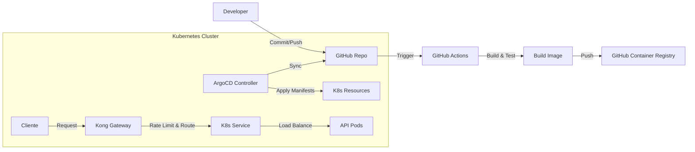

# Desafío DevOps - Micro-API de Saldo

Este repositorio contiene la implementación de referencia para el desafío técnico de DevOps. Implementa un flujo GitOps completo para desplegar una API de consulta de saldo en Kubernetes, expuesta a través de Kong Gateway.

## 1. Arquitectura

El flujo de trabajo sigue un enfoque GitOps y Zero Trust:



### Componentes:
- **Aplicación**: Python FastAPI (ligero, rápido).
- **Container**: Docker Multi-stage build (imagen final ~100MB), usuario no-root.
- **CI**: GitHub Actions (Tests, Build, Push a GHCR).
- **CD/GitOps**: ArgoCD (Sincronización automática del estado deseado).
- **Gateway**: Kong Ingress Controller (DB-less) para exposición y Rate Limiting.
- **Registry**: GitHub Container Registry (GHCR).

## 2. How-to Reproducible

### Prerrequisitos
- Docker Desktop (con Kubernetes habilitado) o Minikube/Kind.
- `kubectl` instalado.
- `git` instalado.

### Paso 1: Configuración del Clúster Local
Ejecuta el script de configuración automática para instalar ArgoCD y Kong:

```bash
./scripts/setup_cluster.sh
```

Este script:
1. Instala ArgoCD en el namespace `argocd`.
2. Instala Kong Ingress Controller (DB-less) en el namespace `kong`.
3. Espera a que los servicios estén listos.

### Paso 2: Configuración de Secretos (Simulación)
En un entorno real, **NUNCA** subas secretos al repositorio.

- **GitHub Actions**: Configura `GITHUB_TOKEN` (automático) para acceder a GHCR.
- **ArgoCD (Repositorio Privado)**:
  Si tu repositorio es privado, ArgoCD necesita credenciales para leer los manifiestos.
  1. Edita el archivo `k8s/repo-secret.yaml` con tu usuario y Personal Access Token (PAT).
  2. Aplícalo en el clúster (¡No hagas commit de este archivo con credenciales reales!):
     ```bash
     kubectl apply -f k8s/repo-secret.yaml
     ```
- **Kubernetes (Pull Image)**:
  Para que el clúster pueda descargar la imagen desde GHCR (que es privado por defecto), necesitas crear un secreto:
  ```bash
  ./scripts/create_docker_secret.sh
  ```
  *Te pedirá tu usuario y PAT con permisos `read:packages`.*

### Paso 3: Despliegue de la Aplicación (GitOps)
1. Asegúrate de que el archivo `k8s/argocd-app.yaml` apunte a TU repositorio de GitHub.
2. Aplica el manifiesto de la aplicación:

```bash
kubectl apply -f k8s/argocd-app.yaml
```

3. Accede a la UI de ArgoCD para verificar el estado:
   - Obtén la password:
     ```bash
     kubectl -n argocd get secret argocd-initial-admin-secret -o jsonpath="{.data.password}" | base64 -d; echo
     ```
   - Abre **https://localhost:8443** (User: `admin`).
   - *Nota: El servicio está expuesto como LoadBalancer en el puerto 8443.*

### Paso 4: Acceso a la API y Rate Limiting
La API está expuesta en el puerto 80 estándar de tu localhost gracias a Kong.

**Prueba de éxito (200 OK):**
```bash
curl -i http://localhost/saldo
```

**Prueba de Rate Limiting (429 Too Many Requests):**
La política está configurada a 5 requests por minuto.
```bash
for i in {1..10}; do curl -I http://localhost/saldo; echo ""; done
```
Deberías ver respuestas `HTTP/1.1 429 Too Many Requests` después de la 5ta petición.

## 3. Decisiones Técnicas

- **Lenguaje (Python/FastAPI)**: Elegido por su simplicidad y rapidez para crear APIs RESTful.
- **Imagen Base (python:3.11-slim)**: Balance ideal entre tamaño y compatibilidad. Alpine a veces da problemas con dependencias de Python (wheels).
- **Seguridad (Non-root)**: Se crea un usuario `appuser` (UID 1001) para ejecutar el proceso, mitigando riesgos de escalada de privilegios.
- **HPA**: Configurado para escalar si la CPU supera el 50%. Se definen `requests` y `limits` en el Deployment para permitir que el HPA calcule el porcentaje.
- **Kong DB-less**: Para un entorno GitOps puro, el modo DB-less es ideal ya que la configuración se inyecta vía CRDs (KongPlugin, Ingress) y no requiere una base de datos Postgres separada.

## 4. Manejo de Tags de Imagen en GitOps
En este ejemplo, el manifiesto `k8s/deployment.yaml` usa `latest` o un tag fijo para simplicidad. En un entorno productivo real, existen dos estrategias principales:

1. **CI Push to Git**: El pipeline de CI, tras construir la imagen `app:sha-123`, hace un commit al repo de configuración actualizando el tag en `deployment.yaml` (o `kustomization.yaml`).
2. **ArgoCD Image Updater**: Un componente adicional que monitorea el registry y actualiza automáticamente la aplicación en ArgoCD cuando detecta una nueva imagen.

## 6. Requisitos Opcionales Implementados

### TLS (Cert-Manager)
Se utiliza `cert-manager` para emitir certificados autofirmados.
- **Issuer**: `k8s/tls-issuer.yaml` (SelfSigned).
- **Ingress**: Configurado con `tls` y `cert-manager.io/cluster-issuer`.
- **Acceso**: Ahora la API responde en `https://localhost/saldo` (acepta el certificado inseguro).

### Autenticación (API Key)
Se utiliza el plugin `key-auth` de Kong.
- **Plugin**: `k8s/auth-plugin.yaml`.
- **Consumer**: `k8s/consumer.yaml` (Usuario: `app-consumer`, Key: `super-secret-key`).
- **Prueba**:
  ```bash
  curl -k -H "apikey: super-secret-key" https://localhost/saldo
  ```

### Gestión de Manifiestos (Kustomize Simplificado)
Se utiliza una estructura plana en `k8s/` con un solo `kustomization.yaml`.
La diferenciación de entornos se maneja dinámicamente en el pipeline de CI:
- Si la rama es `main` -> Configura variables de **Producción**.
- Si es otra rama -> Configura variables de **Desarrollo**.

El pipeline inyecta estas variables en un `ConfigMap` dentro de `kustomization.yaml` antes de hacer commit.

### Automatización CI/GitOps
El pipeline de GitHub Actions:
1. Construye la imagen.
2. Detecta la rama.
3. Edita `k8s/kustomization.yaml` con el nuevo tag de imagen y las variables de entorno correspondientes.
4. Hace commit y push.
5. ArgoCD sincroniza el cambio.

### Makefile
Se incluye un `Makefile` para simplificar la operación:
- `make setup`: Instala todo (Cluster, ArgoCD, Kong, Cert-Manager, Secretos).
- `make deploy`: Aplica la App en ArgoCD.
- `make test`: Ejecuta pruebas de conectividad y auth.

## 7. Evidencias

*(Espacio reservado para screenshots del usuario)*
- GitHub Actions Pipeline: [Insertar imagen]
- ArgoCD Synced: [Insertar imagen]
- Rate Limiting Output: [Insertar output de consola]
