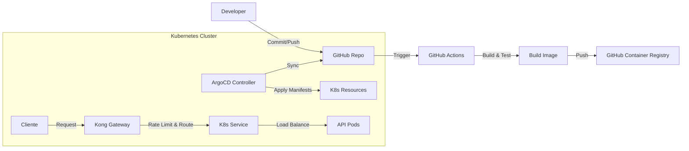
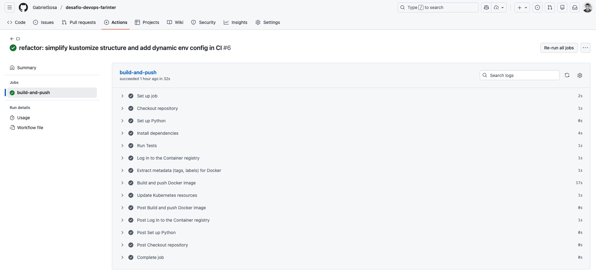
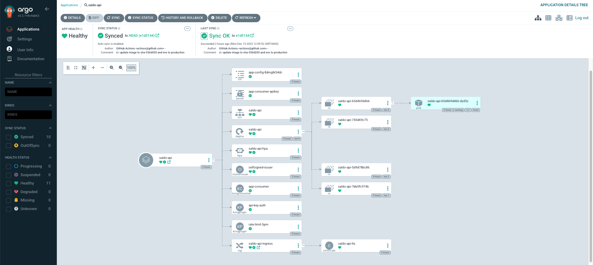
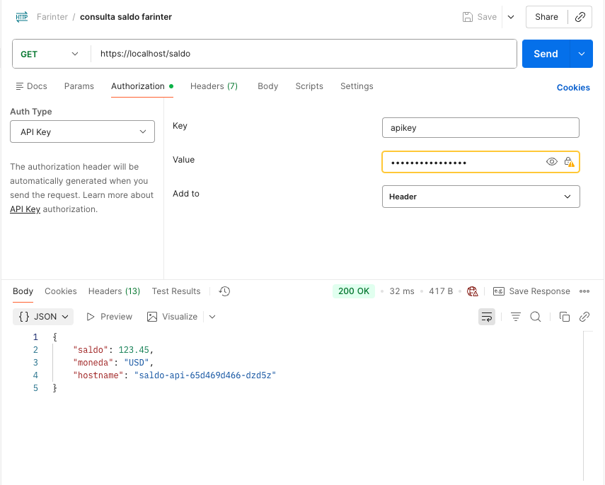
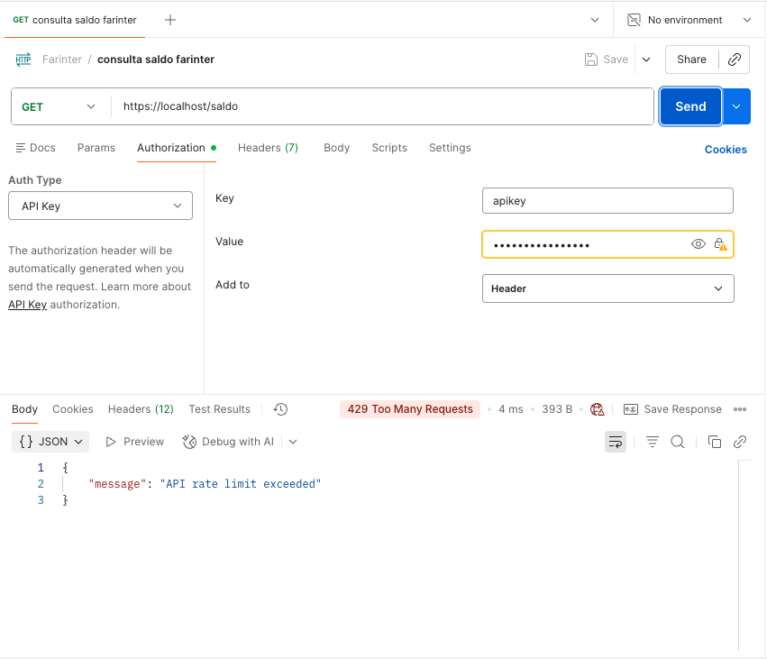
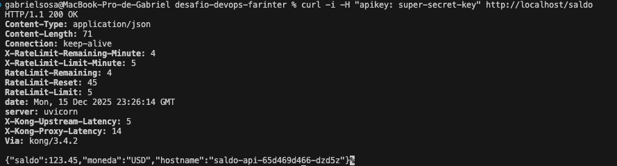
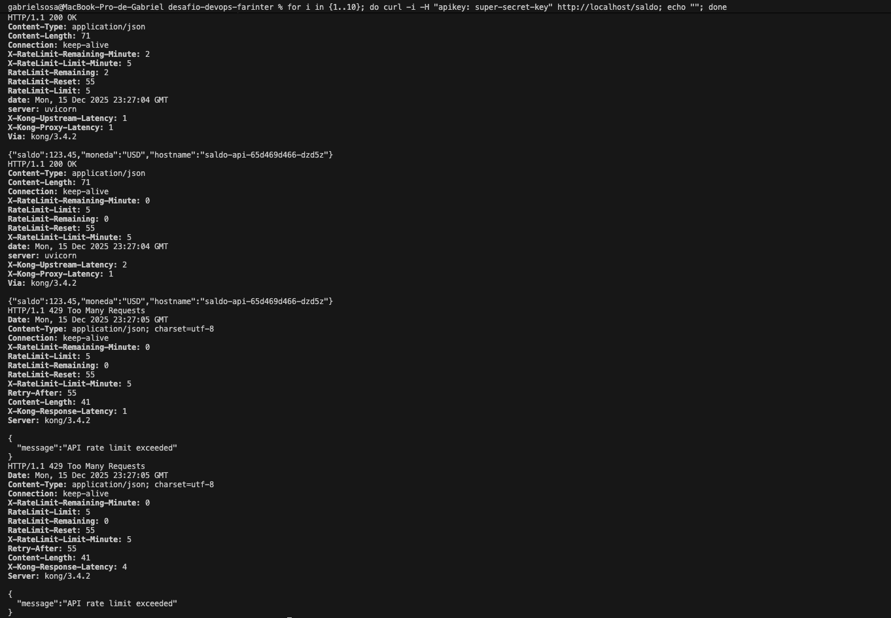

# Desafío DevOps - Micro-API de Saldo

Este repositorio contiene la implementación de referencia para el desafío técnico de DevOps. Implementa un flujo GitOps completo para desplegar una API de consulta de saldo en Kubernetes, expuesta a través de Kong Gateway.

## 1. Arquitectura

El flujo de trabajo sigue un enfoque GitOps y Zero Trust:



### Componentes:
- **Aplicación**: Python FastAPI (ligero, rápido).
- **Container**: Docker Multi-stage build (imagen final ~100MB), usuario no-root.
- **CI**: GitHub Actions (Tests, Build, Push a GHCR).
- **CD/GitOps**: ArgoCD (Sincronización automática del estado deseado).
- **Gateway**: Kong Ingress Controller (DB-less) para exposición y Rate Limiting.
- **Registry**: GitHub Container Registry (GHCR).

## 2. How-to Reproducible

### Prerrequisitos
- Docker Desktop (con Kubernetes habilitado) o Minikube/Kind.
- `kubectl` instalado.
- `git` instalado.

### Paso 1: Configuración del Clúster Local
Ejecuta el script de configuración automática para instalar ArgoCD y Kong:

```bash
./scripts/setup_cluster.sh
```

Este script:
1. Instala ArgoCD en el namespace `argocd`.
2. Instala Kong Ingress Controller (DB-less) en el namespace `kong`.
3. Espera a que los servicios estén listos.

### Paso 2: Configuración de Secretos
Para gestionar las credenciales de forma segura (GHCR, Git, API Keys), hemos centralizado todo en un único script que lee de un archivo `.env`.

1. Copia el ejemplo y configura tus credenciales:
   ```bash
   cp .env.example .env
   # Edita .env con tu GITHUB_USER, GITHUB_PAT, etc.
   ```

2. Ejecuta el script de configuración de secretos:
   ```bash
   ./scripts/setup_secrets.sh
   ```

Este script configurará automáticamente:
- **ghcr-secret**: Para descargar imágenes privadas.
- **private-repo-creds**: Para que ArgoCD acceda a tu repo.
- **app-consumer-apikey**: La API Key para Kong.

### Paso 3: Despliegue de la Aplicación (GitOps)
1. Asegúrate de que el archivo `k8s/argocd-app.yaml` apunte a TU repositorio de GitHub.
2. Aplica el manifiesto de la aplicación:

```bash
kubectl apply -f k8s/argocd-app.yaml
```

3. Accede a la UI de ArgoCD para verificar el estado:
   - Obtén la password:
     ```bash
     kubectl -n argocd get secret argocd-initial-admin-secret -o jsonpath="{.data.password}" | base64 -d; echo
     ```
   - Abre **https://localhost:8443** (User: `admin`).
   - *Nota: El servicio está expuesto como LoadBalancer en el puerto 8443.*

### Paso 4: Acceso a la API y Rate Limiting
La API está expuesta en el puerto 80 estándar de tu localhost gracias a Kong.

**Prueba de éxito (200 OK):**
```bash
curl -i http://localhost/saldo
```

**Prueba de Rate Limiting (429 Too Many Requests):**
La política está configurada a 5 requests por minuto.
```bash
for i in {1..10}; do curl -I http://localhost/saldo; echo ""; done
```
Deberías ver respuestas `HTTP/1.1 429 Too Many Requests` después de la 5ta petición.

## 3. Decisiones Técnicas

- **Lenguaje (Python/FastAPI)**: Elegido por su simplicidad y rapidez para crear APIs RESTful.
- **Imagen Base (python:3.11-slim)**: Balance ideal entre tamaño y compatibilidad. Alpine a veces da problemas con dependencias de Python (wheels).
- **Seguridad (Non-root)**: Se crea un usuario `appuser` (UID 1001) para ejecutar el proceso, mitigando riesgos de escalada de privilegios.
- **HPA**: Configurado para escalar si la CPU supera el 50%. Se definen `requests` y `limits` en el Deployment para permitir que el HPA calcule el porcentaje.
- **Kong DB-less**: Para un entorno GitOps puro, el modo DB-less es ideal ya que la configuración se inyecta vía CRDs (KongPlugin, Ingress) y no requiere una base de datos Postgres separada.
- **CI/CD (GitHub Actions + ArgoCD)**: GitHub Actions se integra nativamente para CI rápido y pruebas. ArgoCD implementa GitOps puro, asegurando que el clúster siempre refleje el estado del repositorio con auto-healing.

## 4. Consideraciones para Producción (Simplificaciones vs Realidad)

Para este desafío se han realizado algunas simplificaciones. En un entorno productivo real, estas serían las estrategias recomendadas:

1.  **Gestión de Secretos**:
    *   *Actual*: Scripts imperativos (`setup_secrets.sh`) y `.env` local.
    *   *Producción*: **External Secrets Operator** (integrado con AWS Secrets Manager/Vault) o **Sealed Secrets** para mantener el enfoque GitOps sin exponer credenciales en el repositorio.

2.  **TLS y Dominios**:
    *   *Actual*: Certificados autofirmados (`SelfSigned`) y acceso vía `localhost`.
    *   *Producción*: **Cert-Manager** con `LetsEncrypt` (ACME) para certificados válidos automáticos y un dominio real configurado en DNS apuntando al LoadBalancer de Kong.

3.  **Persistencia y Alta Disponibilidad**:
    *   *Actual*: Kong en modo DB-less (en memoria) y almacenamiento local.
    *   *Producción*: Kong con base de datos (Postgres) si se requieren features dinámicas complejas, o mantener DB-less con alta disponibilidad de réplicas y almacenamiento persistente distribuido si fuera necesario.

4.  **Manejo de Tags de Imagen**:
    *   *Actual*: Uso de tags fijos o `latest` para simplicidad en el deployment.
    *   *Producción*: **ArgoCD Image Updater** para monitorear el registry y actualizar automáticamente la aplicación, o un paso de CI que haga commit del nuevo tag (`app:sha-123`) al repositorio de configuración.

## 5. Requisitos Opcionales Implementados

### TLS (Cert-Manager)
Se utiliza `cert-manager` para emitir certificados autofirmados.
- **Issuer**: `k8s/kong/tls-issuer.yaml` (SelfSigned).
- **Ingress**: Configurado con `tls` y `cert-manager.io/cluster-issuer`.
- **Acceso**: Ahora la API responde en `https://localhost/saldo` (acepta el certificado inseguro).

### Autenticación (API Key)
Se utiliza el plugin `key-auth` de Kong.
- **Plugin**: `k8s/kong/auth-plugin.yaml`.
- **Consumer**: `k8s/kong/consumer.yaml` (Usuario: `app-consumer`, Key: `super-secret-key`).
- **Prueba**:
  ```bash
  curl -k -H "apikey: super-secret-key" https://localhost/saldo
  ```

### Gestión de Manifiestos (Kustomize Simplificado)
Se utiliza una estructura organizada en `k8s/` con un solo `kustomization.yaml` que orquesta los recursos en `k8s/app/` y `k8s/kong/`.
La diferenciación de entornos se maneja dinámicamente en el pipeline de CI:
- Si la rama es `main` -> Configura variables de **Producción**.
- Si es otra rama -> Configura variables de **Desarrollo**.

El pipeline inyecta estas variables en un `ConfigMap` dentro de `kustomization.yaml` antes de hacer commit.

### Automatización CI/GitOps
El pipeline de GitHub Actions:
1. Construye la imagen.
2. Detecta la rama.
3. Edita `k8s/kustomization.yaml` con el nuevo tag de imagen y las variables de entorno correspondientes.
4. Hace commit y push.
5. ArgoCD sincroniza el cambio.

### Makefile
Se incluye un `Makefile` para simplificar la operación:
- `make setup`: Instala todo (Cluster, ArgoCD, Kong, Cert-Manager, Secretos).
- `make deploy`: Aplica la App en ArgoCD.
- `make test`: Ejecuta pruebas de conectividad y auth.

## 6. Evidencias

### GitHub Actions Pipeline
<p align="center">
  
</p>

### ArgoCD Synced
<p align="center">
  
</p>

### Rate Limiting

**Caso Exitoso (200 OK):**
<p align="center">
  
</p>

**Caso Bloqueado (429 Too Many Requests):**
<p align="center">
  
</p>

**Prueba en Terminal - Exitoso:**
<p align="center">
  
</p>

**Prueba en Terminal - Rate Limit:**
<p align="center">
  
</p>
